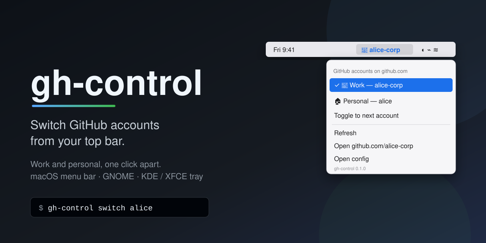
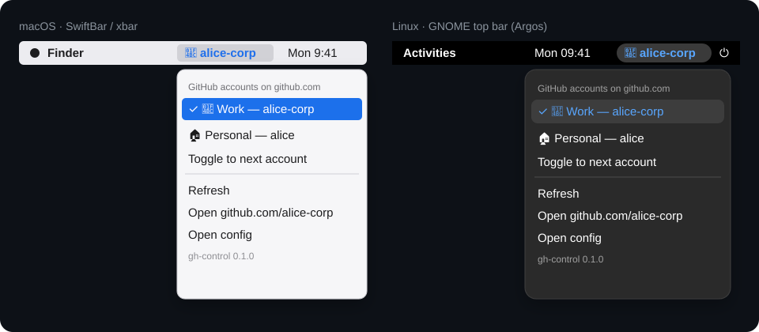

<div align="center">



# gh-control

**See which GitHub account is active, and switch between work and personal with one click from your top bar.**

[](https://github.com/abdulahwahdi/gh-control/actions/workflows/ci.yml)
[](LICENSE)
[](https://www.python.org/)
[](#-platform-setup)
[](https://cli.github.com)
[](pyproject.toml)

[Quick start](#-quick-start) ·
[Install options](#-install-options) ·
[Configuration](#-configuration) ·
[Troubleshooting](#-troubleshooting) ·
[FAQ](#-faq)

</div>

---

## Table of contents

- [Why?](#-why)
- [Features](#-features)
- [What it looks like](#-what-it-looks-like)
- [Quick start](#-quick-start)
- [Install options](#-install-options)
- [Platform setup](#-platform-setup)
- [CLI reference](#-cli-reference)
- [Configuration](#-configuration)
- [Git identity switching](#-git-identity-switching)
- [Updating](#️-updating)
- [Privacy and security](#-privacy-and-security)
- [Troubleshooting](#-troubleshooting)
- [FAQ](#-faq)
- [Uninstall](#-uninstall)
- [Contributing](#-contributing)
- [License](#-license)

## 🤔 Why?

The GitHub CLI can keep several accounts logged in at once (`gh auth login`
twice), but only one is *active*, and nothing tells you which one it is
until a `gh pr create` lands in the wrong place. `gh-control` puts the
active account in your menu bar or top bar and lets you switch with one
click. It's a thin wrapper around `gh auth switch`, with no daemon, no
extra login and no dependencies beyond Python 3 and `gh`.

## ✨ Features

- 👀 **Always visible**: the active account sits in the bar, e.g. `💼 alice-corp`, with your own icon, label and colour.
- 🖱️ **One-click switching**: pick an account from the dropdown, or use *Toggle to next account*.
- 🍎 **macOS**: [SwiftBar](https://swiftbar.app) or [xbar](https://xbarapp.com) plugin, with SF Symbols support in SwiftBar.
- 🐧 **Linux**: [Argos](https://extensions.gnome.org/extension/1176/argos/) plugin for the GNOME top bar, or an AppIndicator tray icon for KDE, XFCE, Cinnamon, MATE and others.
- 🪪 **Git identity for every account**: switching also sets `git config --global user.name` / `user.email`, using your GitHub name and noreply email (fetched once and cached) or values from the config. Per-repository identities too, with `gh-control identity apply --local`.
- 🔔 **Notifications** on switch (`osascript` on macOS, `notify-send` on Linux), skipped if not available.
- ⚡ **Fast and offline**: reads gh's `hosts.yml` directly and only falls back to `gh auth status` when needed.
- 🔒 **Safe**: never prints tokens and never touches your SSH keys.
- 🩺 **`gh-control doctor`** checks your setup and tells you how to fix each problem.
- 📦 **Zero dependencies**: Python standard library only. Install with a one-liner, pipx, pip or Homebrew.

## 👀 What it looks like

<p align="center">
  
</p>

The dropdown in plain text (this is what `gh-control menu` renders, minus the
SwiftBar/Argos parameters):

```text
💼 alice-corp                      ← bar title (icon + active login, in your colour)
───────────────────────────────
GitHub accounts on github.com
✓ 💼 Work — alice-corp            ← active account
     🏠 Personal — alice           ← click to switch
Toggle to next account
Git: Alice Example <alice@corp.example>   ← identity git uses for commits
───────────────────────────────
Refresh
Open github.com/alice-corp
Open config
gh-control 0.1.0
```

If `gh` is missing or nobody is logged in, the bar shows `⚠ gh` and the
dropdown explains what to do. You never get a traceback in your menu bar.
If the active account has no git identity yet, or git's global email belongs
to another account, a `⚠` row offers a one-click fix.

## 🚀 Quick start

You need **Python 3.8+** and the **[GitHub CLI](https://cli.github.com) 2.40 or newer**.

**1. Install gh-control**

```sh
curl -fsSL https://raw.githubusercontent.com/abdulahwahdi/gh-control/main/install.sh | sh
```

This installs the CLI for your user (no `sudo`), adds the top-bar plugin
for your desktop and runs `gh-control doctor`. It's safe to run again; a
second run upgrades or repairs the install.

**2. Log in to your second account** (skip any account that's already logged in)

```sh
gh auth login   # e.g. your corporate account
gh auth login   # and your personal account
gh-control list
```

**3. Add it to your top bar** (the installer already did this; run it again after installing SwiftBar, xbar or Argos)

```sh
gh-control install
```

Then click the account name in your bar to switch. 🎉

> [!TIP]
> Run `gh-control doctor` whenever something looks off. Every warning comes with the command that fixes it.

## 📦 Install options

The one-liner is the easiest way. Expand an option below for the others.

<details>
<summary><b>🌀 curl one-liner</b> (recommended)</summary>

```sh
curl -fsSL https://raw.githubusercontent.com/abdulahwahdi/gh-control/main/install.sh | sh
```

The installer tries `pipx`, then `python3 -m pip --user`, then falls back to a
plain copy in `~/.local/share/gh-control` with a link at
`~/.local/bin/gh-control`. Then it runs `gh-control install` and
`gh-control doctor`. It never needs root.

Options go after `sh -s --`:

```sh
# Preview without changing anything
curl -fsSL https://raw.githubusercontent.com/abdulahwahdi/gh-control/main/install.sh | sh -s -- --dry-run

# Pin a release, choose the install method or the frontend
curl -fsSL https://raw.githubusercontent.com/abdulahwahdi/gh-control/main/install.sh | sh -s -- --ref v0.1.0 --method pipx --frontend argos
```

| Option | Meaning |
| --- | --- |
| `--dry-run` | Print what would be done and change nothing |
| `--uninstall` | Remove the plugin and the CLI (your config is kept) |
| `--ref <tag>` | Install this tag or branch (default: `main`) |
| `--method <m>` | `auto` (default), `pipx`, `pip` or `source` |
| `--frontend <f>` | Passed to `gh-control install`: `auto`, `swiftbar`, `xbar`, `argos` or `tray` |
| `-h`, `--help` | Show help |

The environment variables `GH_CONTROL_REPO` (`owner/name`) and
`GH_CONTROL_REF` work too, for example to install from a fork.

Prefer to read scripts before running them? Good idea:

```sh
curl -fsSL https://raw.githubusercontent.com/abdulahwahdi/gh-control/main/install.sh -o install.sh
less install.sh
sh install.sh
```

</details>

<details>
<summary><b>🧰 pipx</b></summary>

```sh
pipx install git+https://github.com/abdulahwahdi/gh-control.git
gh-control install
```

Upgrade with `pipx upgrade gh-control`, or by running the same
`pipx install --force …` command again.

</details>

<details>
<summary><b>🐍 pip</b></summary>

```sh
python3 -m pip install --user git+https://github.com/abdulahwahdi/gh-control.git
gh-control install
```

Make sure your user scripts folder (often `~/.local/bin`) is on your `PATH`.
On distributions that block `pip install --user` (PEP 668 "externally
managed environment"), use pipx or the one-liner instead.

</details>

<details>
<summary><b>🍺 Homebrew</b> (macOS / Linuxbrew)</summary>

```sh
brew install abdulahwahdi/tap/gh-control
brew install --cask swiftbar   # macOS: if you don't have SwiftBar or xbar yet
gh-control install
```

The formula pulls in `gh` for you. Maintainers: see
[`packaging/homebrew/README.md`](packaging/homebrew/README.md) for how to
publish the tap.

</details>

<details>
<summary><b>🛠️ From a git clone</b></summary>

```sh
git clone https://github.com/abdulahwahdi/gh-control.git
cd gh-control
sh install.sh            # installs this checkout (same options as the one-liner)
```

Or run it straight from the checkout without installing anything:

```sh
./bin/gh-control list
./bin/gh-control install   # links the plugin from this checkout
```

</details>

## 💻 Platform setup

`gh-control install` picks the right frontend automatically:

| OS | Detected frontend | Plugin goes to |
| --- | --- | --- |
| macOS | SwiftBar (if found), else xbar | SwiftBar's configured plugin folder, or `~/Library/Application Support/SwiftBar/Plugins` / `~/Library/Application Support/xbar/plugins` |
| Linux (GNOME + Argos) | Argos | `~/.config/argos/` |
| Linux (other desktops) | AppIndicator tray | `~/.config/autostart/gh-control-tray.desktop` |

Use `--frontend` to choose one yourself and `--plugin-dir` to use another
plugin folder. Add `--dry-run` to preview. The plugin is a **symlink** into
the installed package, so upgrades are picked up automatically.

### 🍎 macOS: SwiftBar or xbar

```sh
brew install --cask swiftbar      # or: brew install --cask xbar
gh-control install                # or: gh-control install --frontend xbar
```

Open SwiftBar. If it asks for a plugin folder, choose the one
`gh-control install` printed (or run
`gh-control install --plugin-dir <folder>` for the folder you picked).
The plugin refreshes every 30 seconds and right after each switch.

### 🐧 GNOME: Argos

1. Install the [Argos extension](https://extensions.gnome.org/extension/1176/argos/).
2. Run:

   ```sh
   gh-control install --frontend argos
   ```

Argos picks up `~/.config/argos/gh-control.30s.sh` by itself and refreshes it every 30 seconds.

### 🐧 KDE, XFCE, Cinnamon, MATE…: AppIndicator tray

The tray icon needs PyGObject and AppIndicator:

```sh
# Debian / Ubuntu
sudo apt install python3-gi gir1.2-ayatanaappindicator3-0.1
# Fedora
sudo dnf install python3-gobject libayatana-appindicator-gtk3
# Arch
sudo pacman -S python-gobject libayatana-appindicator
```

```sh
gh-control install --frontend tray
```

This adds an autostart entry, so the tray starts at your next login.
`gh-control install` prints the command to start it right away. On GNOME
without Argos, the tray also works with the *AppIndicator and KStatusNotifierItem
Support* extension.

## 🔧 CLI reference

| Command | What it does |
| --- | --- |
| `gh-control list [--json]` | List logged-in accounts; `*` marks the active one |
| `gh-control current [--json]` | Print the active login |
| `gh-control switch <user> [--no-notify]` | Make `<user>` the active account (and apply its git identity) |
| `gh-control toggle [--no-notify]` | Switch to the next account in the list |
| `gh-control identity [show] [--json]` | Show each account's git identity and where it comes from, plus what git uses now |
| `gh-control identity sync [--user LOGIN] [--force]` | Fetch names and noreply emails from GitHub and cache them |
| `gh-control identity set <login> [--name N] [--email E]` | Save an identity for an account in the config (an empty value removes it) |
| `gh-control identity apply [--user LOGIN] [--local] [--path DIR]` | Write an account's identity to git: globally, or with `--local` for one repository |
| `gh-control menu [--format swiftbar\|argos\|json]` | Print the top-bar menu (used by the plugins) |
| `gh-control open-config [--print-path]` | Create the config file if missing and open it |
| `gh-control install [--frontend F] [--plugin-dir DIR] [--dry-run]` | Install the top-bar plugin; `F` is `auto`, `swiftbar`, `xbar`, `argos` or `tray` |
| `gh-control uninstall [--plugin-dir DIR] [--dry-run]` | Remove the plugin (config is kept) |
| `gh-control doctor` | Check the setup and suggest fixes |
| `gh-control update [--check] [--dry-run]` | Upgrade to the latest release the same way gh-control was installed; `--check` only looks (`--json` for machine output) |
| `gh-control --version` | Print the version |

```console
$ gh-control list
* 💼 alice-corp  (Work)
  🏠 alice  (Personal)
$ gh-control switch alice
Switched to 🏠 alice (Personal)
Git identity: alice <102+alice@users.noreply.github.com>
$ gh-control current
alice
```

`python3 -m gh_control …` works too, if the package is importable.

## 📝 Configuration

Configuration is **optional**. Without a config file, accounts are
discovered from `gh` and shown with a `●` icon. To customise them, run:

```sh
gh-control open-config
```

This creates `~/.config/gh-control/config.json` (or
`$XDG_CONFIG_HOME/gh-control/config.json`), filled in with your current
accounts, and opens it. A full example:

```json
{
  "host": "github.com",
  "notify": true,
  "set_git_identity": true,
  "auto_git_identity": true,
  "check_updates": true,
  "accounts": {
    "alice-corp": {
      "label": "Work",
      "icon": "💼",
      "color": "#1f6feb",
      "sfimage": "briefcase.fill",
      "git_name": "Alice Example",
      "git_email": "alice@corp.example"
    },
    "alice": {
      "label": "Personal",
      "icon": "🏠",
      "color": "#2da44e",
      "sfimage": "house.fill",
      "git_name": "Alice",
      "git_email": "alice@users.noreply.github.com"
    }
  }
}
```

| Key | Default | Meaning |
| --- | --- | --- |
| `host` | `github.com` | The gh host whose accounts are shown and switched (e.g. a GitHub Enterprise host) |
| `notify` | `true` | Show a desktop notification after switching |
| `set_git_identity` | `true` | Write the account's git identity to `git config --global` when switching |
| `auto_git_identity` | `true` | Fill missing `git_name` / `git_email` from GitHub (name and noreply email, cached). `false` uses only the config values, as before |
| `check_updates` | `true` | Look for a new gh-control release once a day in the background and show **Update now** in the menu and doctor. `gh-control update` works either way |
| `accounts` | `{}` | Per-account settings, keyed by GitHub login. Accounts listed here come first in the menu, in this order |
| `accounts.<login>.label` | the login | Friendly name shown in the dropdown, e.g. `Work — alice-corp` |
| `accounts.<login>.icon` | `●` | Text or emoji shown before the login, in the bar and in the dropdown |
| `accounts.<login>.color` | none | Colour for the bar title and the active row, e.g. `#1f6feb` (SwiftBar, xbar, Argos) |
| `accounts.<login>.sfimage` | none | SF Symbol name for the bar title (SwiftBar only; ignored elsewhere) |
| `accounts.<login>.git_name` | GitHub name, or the login | Value for `git config --global user.name` on switch |
| `accounts.<login>.git_email` | GitHub noreply email | Value for `git config --global user.email` on switch |

Every key is optional. A missing key or a value of the wrong type is ignored
and the default is used. If the file isn't valid JSON, the menu shows a
`⚠` row that says so, and everything else keeps working.

<details>
<summary><b>Environment variables</b></summary>

| Variable | Meaning |
| --- | --- |
| `GH_CONTROL_CONFIG` | Use this config file instead of the default path |
| `GH_CONTROL_GH` | Use this `gh` executable |
| `GH_CONTROL_SEARCH_PATH` | Folders to search for `gh` when it isn't on `PATH` (separated by `:`) |
| `GH_CONTROL_NO_NOTIFY` | Any non-empty value turns notifications off |
| `GH_CONTROL_NO_UPDATE_CHECK` | Any non-empty value turns the menu's daily background release check off |
| `GH_CONTROL_REPO` | `owner/name` to check and update from, e.g. a fork (default `abdulahwahdi/gh-control`) |
| `GH_CONFIG_DIR` / `XDG_CONFIG_HOME` | Honoured when locating gh's `hosts.yml`, as gh itself does |

Menu-bar apps often start with a minimal `PATH`, so gh-control also looks for
`gh` in `/opt/homebrew/bin`, `/usr/local/bin`, `/home/linuxbrew/.linuxbrew/bin`,
`~/.local/bin`, `/usr/bin` and `/snap/bin`.

</details>

## 🪪 Git identity switching

`gh auth switch` changes the account `gh` uses (and git over HTTPS, if gh is
your git credential helper via `gh auth setup-git`). It does **not** change
the name and email recorded in your commits. gh-control does: every switch
also runs

```sh
git config --global user.name  "<name>"
git config --global user.email "<email>"
```

Every account gets an identity automatically, so commits never keep the
previous account's author:

- **From GitHub.** The first time it's needed (on switch, or with
  `gh-control identity sync`), gh-control asks `gh api users/<login>` for the
  account's public name and numeric ID. The name is your GitHub name (or the
  login if you haven't set one), and the email is your
  [noreply address](https://docs.github.com/en/account-and-profile/setting-up-and-managing-your-personal-account-on-github/managing-email-preferences/setting-your-commit-email-address),
  `ID+login@users.noreply.github.com`. The result is cached in
  `~/.config/gh-control/identities.json`, so later switches work offline.
- **From the config.** `git_name` / `git_email` for an account override the
  GitHub values, field by field. Set them by hand or with
  `gh-control identity set <login> --name "Alice" --email alice@corp.example`.

```console
$ gh-control identity
* 💼 alice-corp  Alice Example <alice@corp.example>  (config)
  🏠 alice  alice <102+alice@users.noreply.github.com>  (github)
git global: Alice Example <alice@corp.example>
```

**Per repository.** Run `gh-control identity apply --local` inside a
repository (or pass `--path DIR`) to write the active account's identity to
that repository's `.git/config` only; add `--user <login>` to use another
account. Repository-level settings (`git config user.email` inside a repo,
or `includeIf` rules) still win over the global value, as usual in git, so
such a repository keeps its author whichever account is active.

- Set `"auto_git_identity": false` to use only the config values (accounts
  without them leave your git config alone, as in earlier versions).
- Set `"set_git_identity": false` to never write git config on switch.
- If GitHub can't be reached, the switch still happens and whatever is
  already known is applied; a warning tells you to run `gh-control identity sync` later.
- The menu shows the identity of the active account and warns when git's
  global email belongs to someone else. `gh-control doctor` checks the same.
- If `git` isn't installed, this step is skipped.

## ⬆️ Updating

When a newer release is out, the dropdown shows **⬆ Update now: gh-control
vX.Y.Z** (plus a link to the release notes). Click it, or run:

```sh
gh-control update           # upgrade in place
gh-control update --check   # only look
gh-control update --dry-run # show what would be run
```

`gh-control update` detects how it was installed and upgrades the same way:

| Installed with | Upgrade |
| --- | --- |
| pipx | `pipx install --force <release tarball>` |
| pip | `python -m pip install --upgrade <release tarball>` (with `--user` outside a virtualenv) |
| Plain copy (`install.sh` without pip/pipx) | The copy in `~/.local/share/gh-control` is replaced from the release tarball, downloaded through `gh api` |
| Homebrew | `brew upgrade gh-control` |
| Git checkout | Left untouched; it prints a `git pull` hint |

When the installer can't tell, it prints the one-line installer command to
run instead. Restart the tray app after updating if you use it.

The latest release is looked up with
`gh api repos/abdulahwahdi/gh-control/releases/latest` (drafts and
prereleases are ignored). The menu does this in the background at most once a
day and caches the result in `update-check.json` next to the config; it never
waits for it. Turn the background check and the menu row off with
`"check_updates": false` or `GH_CONTROL_NO_UPDATE_CHECK=1`. Set
`GH_CONTROL_REPO=owner/name` to follow a fork.

## 🔒 Privacy and security

- **No tokens are shown or stored.** gh-control uses only the account
  names from gh's `hosts.yml`, read locally with no network access. It never prints,
  copies or sends your OAuth tokens anywhere, and it has no network code
  of its own. The only GitHub request it makes for git identities is
  `gh api users/<login>`, run through gh on switch or `identity sync`. That
  reads public profile data (name and numeric ID) only; private emails are
  never read, and only the noreply address is stored. The only other request
  is the release check, `gh api repos/abdulahwahdi/gh-control/releases/latest`,
  at most once a day from the menu (turn it off with `"check_updates": false`)
  or when you run `gh-control update`.
- **SSH keys are untouched.** Switching changes gh's active account only.
  Your `~/.ssh` folder, SSH config and agent are never read or modified.
  If you use different SSH keys per account, keep using host aliases in
  `~/.ssh/config` as before.
- **Switching uses gh itself** (`gh auth switch --hostname <host> --user <login>`),
  so gh's own credential storage (keyring or file) stays in charge.
- **No root.** Everything installs into your home directory. The
  installer and `gh-control install` never overwrite files they didn't create.

Found a vulnerability? Please see [SECURITY.md](SECURITY.md).

## 🩺 Troubleshooting

Start with:

```sh
gh-control doctor
```

It checks Python, gh, your config, logged-in accounts, the plugin link, the
menu-bar app and notifications, and prints a fix under each problem. It
exits with status 1 if something stops gh-control from working.

| `doctor` says | What to do |
| --- | --- |
| ✗ `GitHub CLI (gh) not found` | Install gh: `brew install gh`, or see [cli.github.com](https://cli.github.com) |
| ✗ `gh X.Y.Z is too old` | Switching needs gh ≥ 2.40: `brew upgrade gh`, or your package manager |
| ✗ `No accounts logged in on github.com` | `gh auth login` |
| ! `Only one account logged in` | Log in to the other account: `gh auth login` |
| ! `No active account` | `gh-control switch <login>` |
| ! `Config problem: …` | Fix the JSON with `gh-control open-config` |
| ! `Top-bar plugin not installed` / `Broken plugin link` | `gh-control install` (safe to re-run) |
| ! `SwiftBar / xbar not found` | `brew install --cask swiftbar` |
| ! `Neither Argos nor PyGObject (tray) found` | Install the [Argos extension](https://extensions.gnome.org/extension/1176/argos/) (GNOME) or the tray packages above |
| ! `No git identity for: …` | `gh-control identity sync`, or set one with `gh-control identity set <login> --name … --email …` |
| ! `Global git email is … but the active account … uses …` | `gh-control identity apply` |
| ! `git not found; git identity switching is skipped` | Install git if you want commits to use the account's identity |
| ! `gh-control vX.Y.Z is available` | `gh-control update` |
| ! `notify-send not found` | Optional: `sudo apt install libnotify-bin` |
| ! `gh-control is not on your PATH` | Add `~/.local/bin` to your `PATH` in `~/.profile` or `~/.zshrc` |

**Other symptoms**

| Symptom | Fix |
| --- | --- |
| The bar shows `⚠ gh` | Open the dropdown; the first row says what's wrong. Then run `gh-control doctor`. |
| Nothing appears in the menu bar | Make sure SwiftBar/xbar is running and its plugin folder is the one `gh-control install` used. Otherwise run `gh-control install --plugin-dir <folder>`. |
| Switch fails with `gh auth switch failed` | Upgrade gh to 2.40 or newer. Check that the account shows up in `gh auth status`. |
| `git push` still uses the old account over SSH | SSH picks keys by host, not by gh account. Use an SSH host alias per account. gh-control doesn't change SSH. |
| The menu is out of date | Click **Refresh**. The plugins refresh every 30 seconds anyway. |

## ❓ FAQ

<details>
<summary><b>Does it work with GitHub Enterprise?</b></summary>

Yes, for one host at a time. Set `"host": "github.example.com"` in the
config and log in to that host with `gh auth login --hostname github.example.com`.

</details>

<details>
<summary><b>More than two accounts?</b></summary>

Yes. Every account logged in on the host is listed, and *Toggle to next
account* cycles through all of them.

</details>

<details>
<summary><b>Does switching affect terminals that are already open?</b></summary>

Yes. `gh` reads the active account each time it runs, so the next `gh`
command in any terminal uses the new account. One exception: a `GH_TOKEN`
or `GITHUB_TOKEN` environment variable overrides the active account for
`gh` in that shell.

</details>

<details>
<summary><b>Why not just use <code>gh auth switch</code>?</b></summary>

You can, and gh-control uses it under the hood. What gh-control adds is
seeing the active account at all times, switching with one click,
per-account labels and colours, and a git identity for every account.

</details>

<details>
<summary><b>Does it need network access?</b></summary>

Hardly. Listing accounts and drawing the menu read gh's local `hosts.yml`
and gh-control's own cache, with no network access. gh-control has no
network code of its own: the only request is `gh api users/<login>`, run
through gh when you switch to an account whose git identity isn't cached
yet, or when you run `gh-control identity sync`. The only other request is
the release check (`gh api repos/abdulahwahdi/gh-control/releases/latest`),
which the menu starts in the background at most once a day and
`gh-control update` runs on demand. Turn it off with `"check_updates": false`
or `GH_CONTROL_NO_UPDATE_CHECK=1`.

</details>

<details>
<summary><b>Can I use it without a menu bar at all?</b></summary>

Yes. `gh-control list`, `current`, `switch` and `toggle` work on their own,
for example from a shell alias or a keyboard shortcut.

</details>

## 🧹 Uninstall

```sh
gh-control uninstall     # removes the top-bar plugin / tray autostart entry
```

Then remove the CLI the way you installed it:

```sh
curl -fsSL https://raw.githubusercontent.com/abdulahwahdi/gh-control/main/install.sh | sh -s -- --uninstall   # one-liner install (also removes the plugin)
pipx uninstall gh-control
python3 -m pip uninstall gh-control
brew uninstall gh-control
```

Your config (`~/.config/gh-control/`) and your gh logins are never removed.
Delete the config folder yourself if you don't need it any more.

## 🤝 Contributing

Contributions are welcome! See [CONTRIBUTING.md](CONTRIBUTING.md) for the
dev setup, how to run the tests and how to add a new frontend. Please follow
the [Code of Conduct](CODE_OF_CONDUCT.md). Notable changes are listed in the
[CHANGELOG](CHANGELOG.md).

## 📄 License

[MIT](LICENSE)
